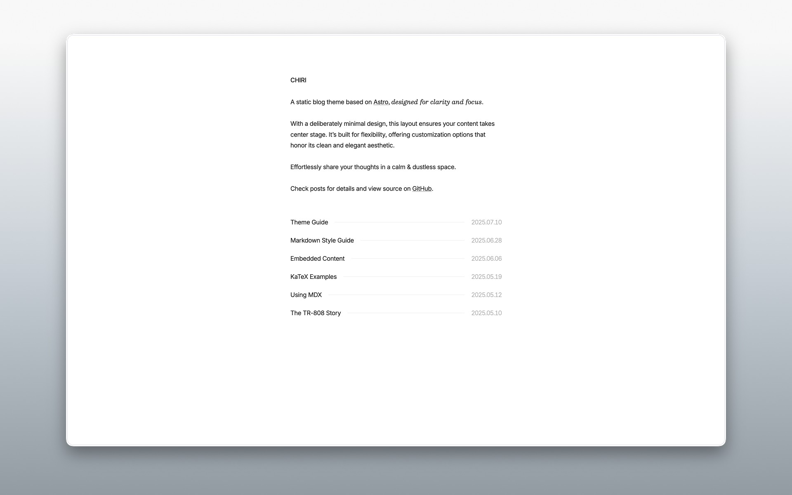
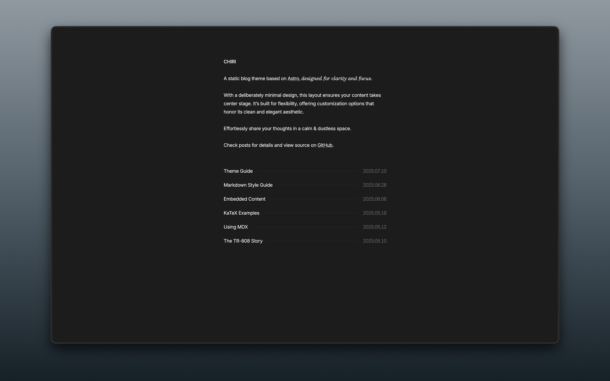

# Chiri 🌸




Chiri 是一个使用 [Astro](https://astro.build) 构建的极简博客主题，它在保持清爽风格的同时，提供了灵活的自定义选项。

查看 [演示](https://chiri.the3ash.com/) 了解更多。

## 功能

- [x] 基于 Astro 构建
- [x] 响应式布局
- [x] 浅色 / 暗色模式
- [x] MDX 支持
- [x] KaTeX 公式渲染
- [x] Sitemap
- [x] OpenGraph
- [x] RSS

## 快速开始

1. 在 GitHub 上 Fork 本仓库，或使用此模板创建新仓库。

2. 运行以下命令：

   ```bash
   git clone <your-repo-url>

   cd <your-repo-name>

   pnpm install

   pnpm dev
   ```

3. 编辑 `src/config.ts` 和 `src/content/about/about.md`，将内容改为你自己的风格。

4. 使用 `pnpm new <title>` 创建新文章，或将文章文件添加到 `src/content/posts`。

5. 运行 `pnpm build` 构建站点，然后将生成的 `dist/` 目录部署到任意静态托管平台。`pnpm dev` 和 `pnpm build` 期间会自动获取 Link Card 元数据，并存储在 `src/data/link-card-metadata.json`，以便卡片渲染为静态 HTML。

- 本模板已包含 GitHub Actions 工作流 `.github/workflows/pages.yml`，可在 `master` 分支推送时自动构建并部署到 GitHub Pages。
- 已添加根目录 `.nojekyll` 文件，防止 GitHub Pages 对 Astro 源文件运行 Jekyll。
- 请在 GitHub 仓库设置中将 Pages 源设置为 **GitHub Actions**，而不是仓库分支根目录。
- 如果你使用 GitHub Pages，请更新 `src/config.ts` 中的 `themeConfig.site.website` 为你的 Pages 地址（例如 `https://<username>.github.io/<repo>/`）或自定义域名。

&emsp;[](https://app.netlify.com/start) [](https://vercel.com/new)

## 命令

- `pnpm new <title>` - 创建新文章（草稿请使用 `_title`）
- `pnpm update-link-metadata` - 刷新 `::link` 卡片的元数据（使用 `--force` 可重新获取已有条目）
- `pnpm update-theme` - 更新主题到最新版本

## 参考

- https://paco.me/
- https://benji.org/
- https://shud.in/
- https://retypeset.radishzz.cc/

## 许可证

MIT
